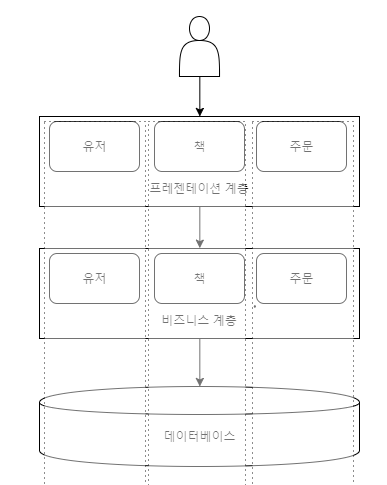
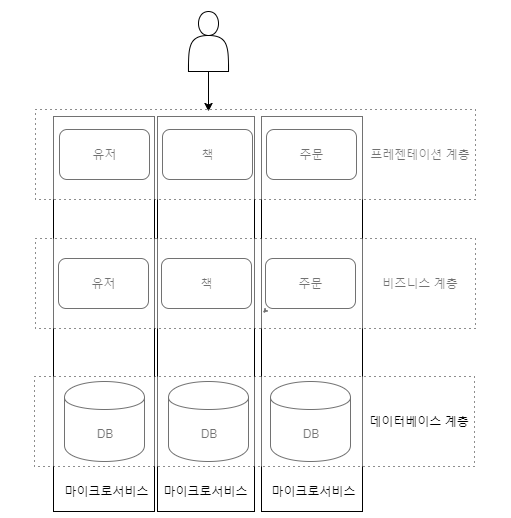
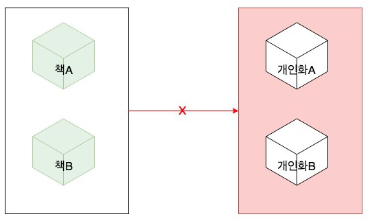
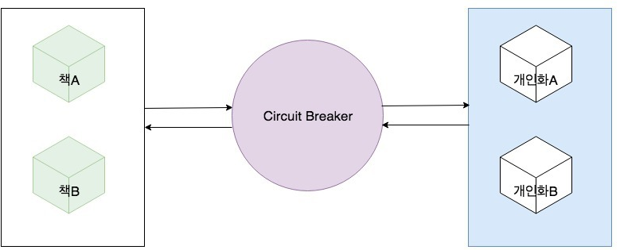
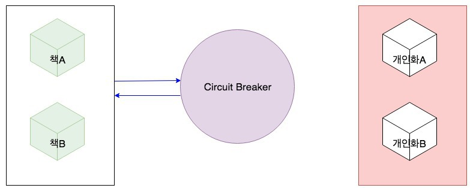
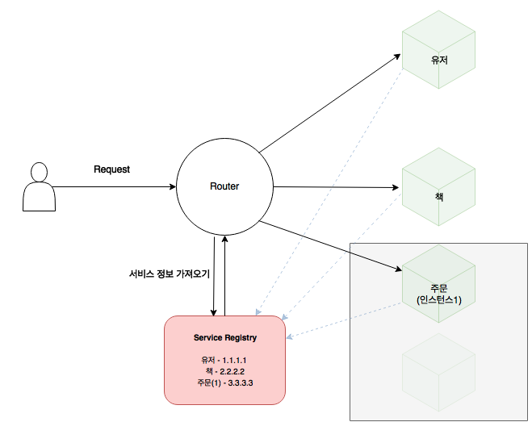

# MSA 란?

참고 사이트: https://alwayspr.tistory.com/19 --> 이거 보는게 이득 

## Monolithic vs MicroService

### Monolithic 

- 위 이미지와 같이 하나의 프로젝트에 모든 서비스들이 묶여있는것을 말함
- 위 이미지에서 추가적인 서비스들이 많이 생긴다면 몇가지 이슈가 생김

### Monolithic 이슈들

- 빌드 시간, 테스트 시간이 길어진다.
- 개발 언어에 종속적이다.
- 선택적으로 확장할 수 없다.
- 하나의 서비스가 모든 서비스에 영향을 준다.

### Micro Service

- 위 이미지와 같이 각각의 서비스가 별도의 프로젝트
- REST API 호출 방식으로 서비스간 통신이 이뤄짐
- 하나의 서비스에 장애가 발생하여도 다른 서비스는 정상 동작

### MSA 장점

- 빌드 및 테스트 시간을 단축시킬 수 있다.
- 폴리글랏 아키텍처 구성이 가능하다. (상황에 맞게 기술을 유연하게 적용)
- 탄력적이고 선택적인 확장이 가능하다.
- 하나의 서비스가 다른 서비스에 영향을 주지 않는다.

### MSA는 장점만?? NO!!!!

- 성능 이슈가 있다.

Monolithic은 다른 서비스 간의 상호작용이 필요할때 Method 호출을 이용한다. 즉, 메모리 안에서 일어나는 작업이기 때문에 빠른 속도로 상호작용이 가능하다. 하지만 MSA는 HTTP 방식으로 상호작용이 일어나기 때문에 Network IO가 발생한다.

- 트랜잭션이 불편하다.

하나의 프로젝트에서는 트랜잭션을 관리하기 편하지만 다른 서비스와 연동 되어야하는 작업에서는 트랜잭션을 관리하기가 어려워짐.

- 관리 포인트가 늘어난다.

Monolithic은 하나의 애플리케이션, DB서버만을 관리하면 되지만 MSA는 서비스가 늘어날 수록 관리해야하는 서버가 늘어난다. 즉, 서버가 늘어난 만큼 모니터링, 배포, 테스트 등의 관리가 늘어남

#### MSA가 모든 상황에서 적합한 것은 아니다. 애플리케이션의 특성을 잘 파악해야함

---

## MSA 와 연관된 기술(?)들

### Circuit Breaker

의미: 에너지가 있는 도선과 중립 도선 사이의 전류 균형이 깨졌을 때, 전류를 차단하는 장치.....?? ㅇㅋ --> 어쨌든 MSA에서 비슷한 역할을 하는애가 있음

MSA의 장점 중 하나가 하나의 서비스가 다른 서비스에 영향을 안 끼친하고 했지만 하나의 서비스가 다른 서비스에 디펜던시를 가지고 있을때는 어쩔 수 없이 영향을 끼침

위 그림과 같이 책 리스트를 호출하는 API(왼쪽)이 있고, 각각의 고객이 구입할만한 책을 추천해주는 API(오른쪽)가 있는데 책 API가 개인화 API를 찔러 정보를 가져와야 하는 상황(디펜던시) 

#### 여기서 만약 개인화 API에 장애가 발생한다면 책 리스트를 가져오는 API역시 장애가 생김

이 문제를 해결해 주는 것이 **Circuit Breaker**

개인화 API 비정상적일 경우에는 Circuit Breaker가 이를 감지하여 개인화 서비스로 보내지 않고, 책 서비스에 다시 되돌려 준다. 이때 Default로 설정되어 있는 개인화 리스트를 돌려 주기 때문에 밖에서 봤을때는 마치 내부에 장애가 없는 것처럼 보여진다.

### API Gateway

MSA는 Method 호출방식이 아닌 REST API 호출 방식으로 서비스간 통신이 이뤄진다고 했음. 하지만 여기서도 몇가지 이슈가 발생한다.

- 서비스마다 주소가 다름
- 로깅, 모니터링 ,CORS 처럼 서비스 간의 공통된 로직의 관리가 필요

#### API Gateway의 기능

1. API요청을 한곳에서 받아 해당 서비스로 라우팅 해준다.

서비스가 별로 없을때는 문제가 없지만 수십개 수백개?로 늘어나면 서비스 하나하나의 주소를 모두 알고 있어야한다. --> 이 문제를 해결해줌

2. 보안을 강화해 준다.

API Gateway는 외부에서 접근할 수 있도록 public으로 열어두고 내부 서비스들은 내부에서만 접근 가능하도록 private로 구축할 수 있게 된다

3. 각 서비스의 공통된 로직을 처리해준다.
4. 스트레스 테스트, 로드밸런싱등의 기능도 있음

### Service Discorvery

서비스 가용성을 위해 하나의 서비스를 여러가지 인스턴스에 올릴 경우도 생긴다. 보통 Cloud 서비스를 사용하면 Auto-scaling을 하는데 이 과정에서 인스턴스(서버)는 새로 생성되기도 삭제되기도 한다. 이 경우 새로 생기거나 삭제되는 인스턴스의 IP 주소를 모두 알고 있어야하는데 이를 감지하는 기능을 Service Discorvery가 해준다.

위 그림과 같이 Service Registry에 각각의 인스턴스 IP주소를 가지고 있고 Router(ex: API Gateway)가 요청이 들어왔을때 Service Registry에 등록된 주소를 기반으로 요청을 전달한다.

- Router는 매번 Service Registry를 거쳐 정보를 가져오는 것이 아니라 캐시 알고리즘을 통해 정보를 저장해 둔다.
- Service Registry는 정해진 시간마다 서비스들에 ping을 보내 헬스체크를 한다.
- 새로운 인스턴스가 뜨면 Service Registry에 정보를 저장한다(어떻게?...)

