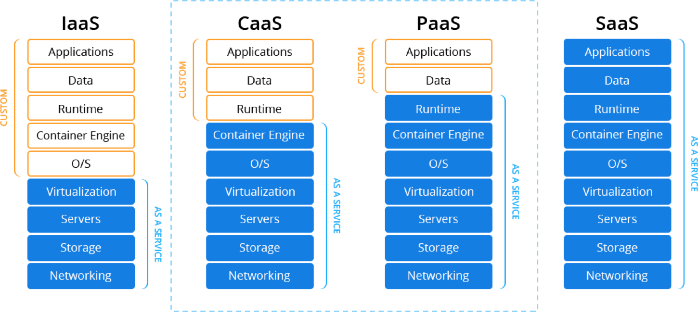

# Cloud Computing
* 인터넷 기반 컴퓨팅의 일종
* 공유 컴퓨터 처리 자원과 데이터를 요청 시 제공
* 구성 가능한 컴퓨팅 자원(서버, 네트워크, 스토리지, Application, 서비스 등)에 대해 언제 어디서나 접근 가능하게 하는 모델
* 최소환의 관리 노력으로 빠르게 예비 및 출시가 가능하도록 함

## Nist에서 정의 한 Cloud의 다섯가지 특징
1. __On-demand self-service__
    * 소비자가 필요에 의해 독자적으로 컴퓨팅 리소스를 주문할 수 있음
2. __Broad network access__
    * 다양한 방식을 통해 접근 가능(다양한 디바이스, 네트워크)
3. __Resource Pooling__
    * 컴퓨팅 리소스는 요청에 따라 동적으로 할당하거나 재 할당할 수 있는 다양한 유무형의 리소스 풀 형태로 제공
    * 사용자는 제공 된 리소스의 정확한 위치를 알거나 관리할 수는 없으나 국가, 지역, 데이터 센터와 같은 상위 수준 위치는 지정할 수 있음
    * 리소스 - 저장장치, 데이터 처리, 메모리, 네트워크 대역폭, VM 등
4. __Rapid Elasticity__
    * 빠르게 확장, 축소 가능
5. __Measured Service__
    * 클라우드 시스템은 서비스 공급자와 소비자 모두에게 투명한 정보를 제공하기 위해 리소스 사용량을 감시, 관리하고 보고

## Cloud Computing 서비스 모델
### Software as a Service (SaaS)
* 다수의 사용자에게 온디맨드로 제공되는 Application 서비스
    * On-demand: 이용자의 요구에 따라 상품이나 서비스가 바로 혹은 소비자가 있는 곳까지 바로 전달 및 제공 되는 것
* Cloud 환경에서 제공되는 Application 서비스
* 번거롭게 소프트웨어를 설치하는 과정 없이 신청하여 바로 사용
* 예) Salesforce, BizRoad(ERP, CRM 등), 네이버 Cloud, Mail 등
* 레고 조립의 완성품

### Platform as a Service (PaaS)
* 개발용 플랫폼 또는 Application 실행에 필요한 소프트웨어 스택
* 소프트웨어 서비스를 개발 할 때 필요한 플랫폼을 제공하는 서비스
* 개발자가 소프트웨어를 개발할 때 필요한 API를 제공해 개발자가 좀 더 편하게 개발할 수 있도록 도울 수 있음
* 예) Cloud Foundry, Google AppEngine
* 레고 블럭
* 흔히들 Kubernetes를 PaaS라고 하지만 엄연히 따지면 Kubernetes는 PaaS와 비슷할 뿐 PaaS는 아님
    * Container as a Service(CaaS)?라고 볼 수 있음
    * CaaS는 굳이 따지자면 IaaS와 PaaS의 사이..? 레고 공장에서 레고 블럭을 만들어내는 틀 쯤..? - 어디까지나 내 생각

### Infrastructure as a Service (IaaS)
* 서버 또는 스토리지 등을 사용자에게 서비스 형태로 제공
* 인프라 자원을 가상화 환경으로 만들어 필요에 따라 사용할 수 있게 서비스를 제공
* 수분, 수시간 내에 컴퓨팅 인프라 구축 가능
* 예) CloudZ, IBM Cloud, Amazon AWS, MS Azure 등
* 레고 공장

## Cloud Computing 배포 모델
### Private Cloud
* Enterprise owned or leased
* Data 보호 및 서비스 수준 문제를 중요시 하는 사용자에게 적함
* 보안성이 뛰어남
* 개별 고객의 상황에 맞게 클라우드 기능을 커스터마이징 할 수 있음
* 주로 ERP, PLM 등 기업 핵심 Application이나 대기업 및 중대형 웹 비즈니스 서비스에 이용
* ZCP Local은 Private 

### Public Cloud
* Sold to the public, mega-scale Infrastructure
* 제 3자에 의해 운영 됨
* CloudZ, AWS 등이 Public Cloud

### Hybrid Cloud
* Composition of Two or more clouds
* 위의 2가지를 결합한 모델, 일정 부분은 소유하고 나머지는 제어된 방법에 따라 공유
* Public의 유연성, 경제성, 신속성과 Private의 보안성, 안정성을 함께 취하는 형태